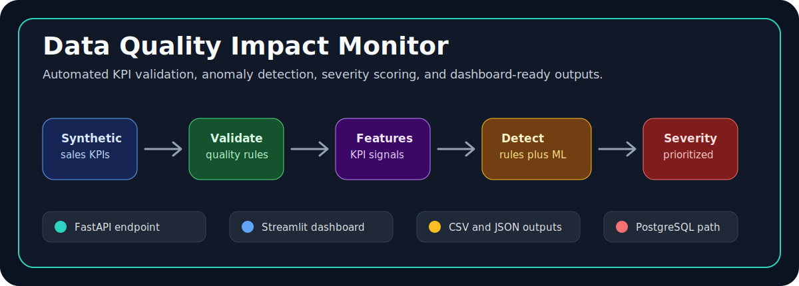
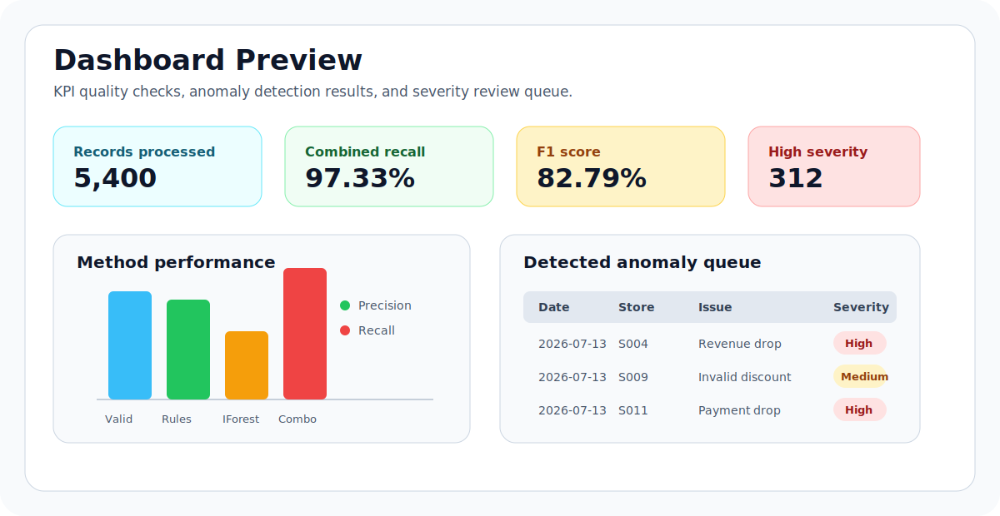
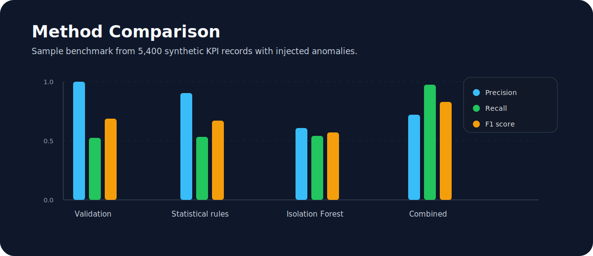

# Data Quality Impact Monitor



[](https://www.python.org/)
[](https://fastapi.tiangolo.com/)
[](https://scikit-learn.org/)
[](https://www.docker.com/)
[](https://docs.pytest.org/)

This is my flagship data project. I built it to answer a simple but important business question:

> Can we automatically check daily KPI data, find suspicious changes, and explain which issues may hurt business reporting?

The project simulates daily sales KPI data, validates the data quality, creates useful features, detects anomalies with both rules and machine learning, classifies severity, and produces outputs for an API and dashboard.

My goal was to make a project that recruiters can understand quickly, but still see real engineering depth behind it.

## Why This Project Matters

Business dashboards are only useful when the data is trusted. A revenue drop could be a real business issue, but it could also be caused by a missing file, bad transformation, duplicate id, or broken payment feed.

This project treats data quality as a business impact problem, not only a technical cleanup task.

## Recruiter Quick View

| What I wanted to show | Where it appears |
| --- | --- |
| Data engineering | Synthetic pipeline, output files, Docker, PostgreSQL path |
| Data quality | Validation rules for missing, invalid, duplicate, and impossible values |
| Data science | Isolation Forest, statistical detection, precision, recall, F1 |
| Analytics thinking | Severity labels, KPI features, dashboard-ready tables |
| Production habits | FastAPI, tests, CI, Docker Compose, config object |
| Communication | Portfolio summary, benchmark docs, interview talking points |

## Sample Result

Sample local run from July 13, 2026:

```bash
python scripts/run_pipeline.py --days 90 --stores 12 --output-dir artifacts
```

| Result | Value |
| --- | ---: |
| Records processed | 5,400 |
| Anomalies detected | 658 |
| Processing time | 0.80 seconds |
| Combined precision | 0.7204 |
| Combined recall | 0.9733 |
| Combined F1 score | 0.8279 |
| High severity findings | 312 |
| Medium severity findings | 187 |
| Low severity findings | 159 |

The combined method catches most injected anomalies while still keeping the result useful for review. The full benchmark is in [docs/sample_run_metrics.md](docs/sample_run_metrics.md).

## Dashboard Preview



The dashboard is designed for a data analyst or analytics engineer. It answers:

- How many KPI records were processed?
- How many anomalies were detected?
- Which methods performed best?
- Which severity level should be reviewed first?
- Which anomaly types were easy or difficult to catch?

## Method Comparison



The main lesson is that each method has a different job:

- Validation rules are very precise for obvious data quality problems.
- Statistical rules are strong for clear KPI changes, especially revenue drops and spikes.
- Isolation Forest helps find multivariate outliers that are not obvious from one column.
- The combined method gives the best recall, which matters when missing a serious KPI issue is expensive.

## Pipeline

```text
Synthetic sales KPI data
        |
        v
Data validation checks
        |
        v
Feature engineering
        |
        v
Statistical rules + Isolation Forest
        |
        v
Severity classification
        |
        v
CSV/JSON outputs + FastAPI + Streamlit dashboard
```

## Anomalies Detected

The monitor catches both data quality errors and business KPI anomalies:

| Anomaly type | Example | Why it matters |
| --- | --- | --- |
| Missing critical fields | Missing store id | Dashboard filters and joins may break |
| Negative revenue | Revenue below zero | Usually impossible for sales KPI reporting |
| Invalid discounts | Discount greater than 100 percent | Indicates bad source data or transformation |
| Payment drop | Success rate falls suddenly | Can hide checkout or provider problems |
| Revenue spike | Sales jump far above history | Could be campaign success or duplicate loading |
| Revenue drop | Sales fall far below history | Could be real business risk or pipeline issue |
| High returns | Returns near or above sold units | Can damage margin reporting |
| Duplicate transaction id | Same id appears twice | Can inflate sales and customer metrics |
| ML outlier | Strange multi-column pattern | Finds issues that simple rules may miss |

## Tech Stack

| Area | Tools |
| --- | --- |
| Core pipeline | Python, Pandas, NumPy |
| Anomaly detection | Statistical rules, Scikit-learn Isolation Forest |
| Data validation | Custom validation checks |
| API | FastAPI |
| Dashboard | Streamlit-ready outputs |
| Database path | PostgreSQL with SQLAlchemy |
| Scaling path | PySpark validation helper |
| Quality | Pytest, Ruff, GitHub Actions |
| Deployment | Docker, Docker Compose |

## Project Structure

```text
.
|-- assets/readme/                  # GitHub README visuals
|-- docs/
|   |-- sample_run_metrics.md        # Benchmark from local run
|-- scripts/run_pipeline.py
|-- src/dq_impact_monitor/
|   |-- synthetic_data.py            # Creates KPI data and injects anomalies
|   |-- validation.py                # Data quality checks
|   |-- features.py                  # Feature engineering
|   |-- detection.py                 # Statistical rules and Isolation Forest
|   |-- severity.py                  # Low, medium, high severity labels
|   |-- metrics.py                   # Precision, recall, F1
|   |-- pipeline.py                  # End-to-end monitor
|   |-- api.py                       # FastAPI endpoints
|   |-- dashboard.py                 # Streamlit dashboard
|   |-- storage.py                   # Optional PostgreSQL writer
|   `-- spark_validation.py          # Optional PySpark validation example
|-- tests/
|-- Dockerfile
|-- docker-compose.yml
`-- .github/workflows/ci.yml
```

## Quick Start

```bash
python -m venv .venv
.venv\Scripts\activate
pip install -e ".[dev]"
python scripts/run_pipeline.py --days 90 --stores 12 --output-dir artifacts
```

The run creates:

- `artifacts/raw_sales.csv`
- `artifacts/validation_findings.csv`
- `artifacts/statistical_findings.csv`
- `artifacts/ml_findings.csv`
- `artifacts/anomalies.csv`
- `artifacts/metrics.json`

## Run the API

```bash
uvicorn dq_impact_monitor.api:app --reload
```

Useful endpoints:

| Endpoint | Purpose |
| --- | --- |
| `GET /health` | Check that the API is running |
| `POST /run-monitor` | Run the monitor and return metrics |

Example request:

```json
{
  "days": 90,
  "stores": 12,
  "anomaly_fraction": 0.08,
  "isolation_contamination": 0.08,
  "output_dir": "artifacts"
}
```

## Run the Dashboard

```bash
streamlit run src/dq_impact_monitor/dashboard.py
```

The dashboard reads generated files from the `artifacts` folder.

## Run Quality Checks

```bash
ruff check .
pytest
```

Current verification:

- Ruff: passed
- Pytest: 2 passed
- API import smoke test: passed

## How I Would Explain This In An Interview

I would say:

> I built a monitoring pipeline that creates synthetic sales KPI data, injects known anomalies, validates the data, detects outliers with both business rules and Isolation Forest, then measures how well the system found the injected issues. I used this because real analytics teams need both clean data and explainable alerts before numbers reach dashboards.

Then I would point to three practical decisions:

- I used injected anomalies so I could measure precision and recall instead of only showing charts.
- I kept validation rules separate from ML because business users need clear explanations.
- I added severity classification because not every anomaly deserves the same urgency.

## Possible Next Improvements

- Add a Great Expectations validation suite beside the custom checks.
- Store every run in PostgreSQL for historical monitoring.
- Add real Power BI screenshots from the generated anomaly tables.
- Add Slack or email alerts for high severity issues.
- Add a PySpark batch job for larger datasets.
- Add a small model monitoring report for drift over time.

## Portfolio Links

- [Sample run metrics](docs/sample_run_metrics.md)
